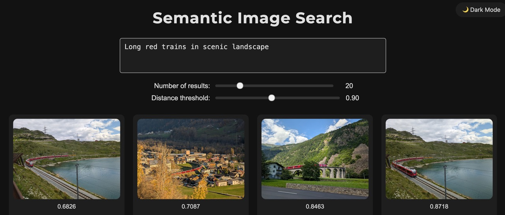

## Semantic Image Search

A local semantic image search tool using `llama3.2-vision:11b` for image -> text description, `all-MiniLM-L6-v2` for text description -> embedding vector, and ChromaDB for fast retrieval. Supports querying with natural language to find relevant images efficiently.



### Overview

```bash
positional arguments:
  {descriptions,embeddings,query,server}
                        Mode of operation.
                            descriptions: process images and create descriptions,
                            embeddings: create embeddings,
                            query: query the database interactively,
                            server: launch backend server

options:
  -h, --help            show this help message and exit
  -p P                  Path to input directory with images
  -o O                  Output directory to save embeddings, defaults to input directory
  -g G                  Glob pattern to filter folders to scan, relative to input directory. Example:
                        "images/2024/**"
```

### Pipeline workflow

1. Create descriptions for all (or some) images. This is the computationally expensive part.

```bash
python pipeline.py descriptions -p ~/temp -o ~/temp/semantic_search
```

2. Compute embeddings for all descriptions using chromadb. This is very fast.

```bash
python pipeline.py embeddings -p ~/temp -o ~/temp/semantic_search
```

3. Run query server

```bash
python pipeline.py server -p ~/temp -o ~/temp/semantic_search
```

4. Open `viewer.html`
